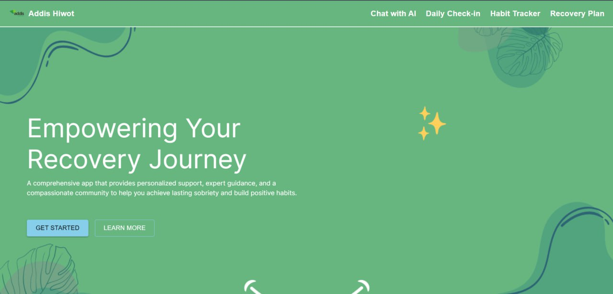
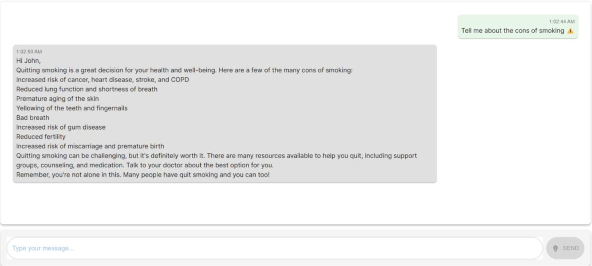
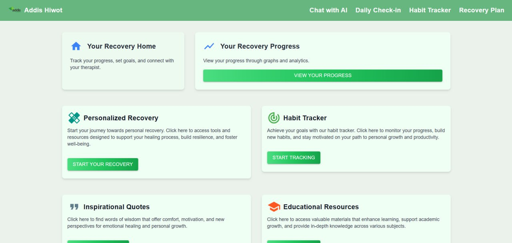
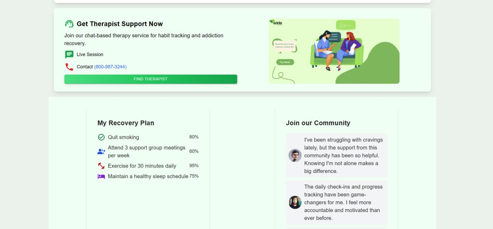

# Addiction Recovery Support Project

## Overview

The **Addiction Recovery Support Project** is an all-encompassing platform designed to assist individuals in their journey toward recovery, mental health improvement, and career development. The platform integrates AI-driven tools, personalized recovery plans, and career guidance to provide a holistic support system.


## Features

1. **AI Chatbot for Immediate Assistance**

   - **User Authentication**: Secure login for all users.
   - **24/7 Availability**: The chatbot is available around the clock to provide support whenever needed.
   - **Empathetic Responses**: The chatbot provides empathetic and supportive responses to users.
   - **Resource Provision**: Users are provided with links to helpful articles, hotlines, and support groups.

2. **Personalized Recovery Plans**
   - **User Profile**: Collects information on user history, preferences, and goals.
   - **Custom Plans**: Generates recovery plans tailored to individual needs.
   - **Adjustable Goals**: Allows users to set and adjust short-term and long-term goals.
   

3. **Progress Tracking**
   - **Milestone Celebration**: Tracks and celebrates user milestones.
   - **Progress Reports**: Provides regular reports on user progress.
   - **Data Visualization**: Visual representation of progress over time.

4. **Mental Health Improvement**
   - **Mood and Behavior Analysis**:
     - Sentiment analysis to understand mood and emotional state.
     - Daily check-ins for mood updates.
     - Behavior trend tracking over time.
   - **Therapeutic Content**:
   
     - Personalized exercises like mindfulness and CBT techniques.
     - Access to a library of articles, videos, and audio resources.
     - Tracking user engagement with therapeutic content.
   - **Crisis Intervention**:
     - Alert system to detect signs of severe distress.
     - Connects users to emergency contacts and resources.
     - Provides immediate guidance and support in crisis situations.


5. **Additional Features To be Added**
   - **Community Support**:
     - Forums for sharing experiences and offering support.
     - Virtual support groups for various topics.
     - Peer connections for mutual support.
   - **Progress Dashboard**:
     - User-friendly dashboard to visualize progress across different areas.
     - Display of key metrics in addiction recovery, mental health, and career development.
     - Customizable views for personalized dashboard experiences.
   - **Privacy and Security**:
     - Data encryption to ensure privacy.
     - Secure authentication methods for user safety.
     - Compliance with data protection regulations such as GDPR and HIPAA.

## Installation

To set up the project locally, follow these steps:

1. Clone the repository:
   ```bash
   git clone https://github.com/abdiesu04/addiction-recovery-support.git
   ```
2 Navigate to the project directory:

```bash

cd ai-recovery
```
3 Install the dependencies:

```bash

npm install
```
4 Start the development server:

```bash

npm run dev
```
Contributing
Contributions are welcome! Please fork the repository and submit a pull request with your changes.

License
This project is licensed under the MIT License.
