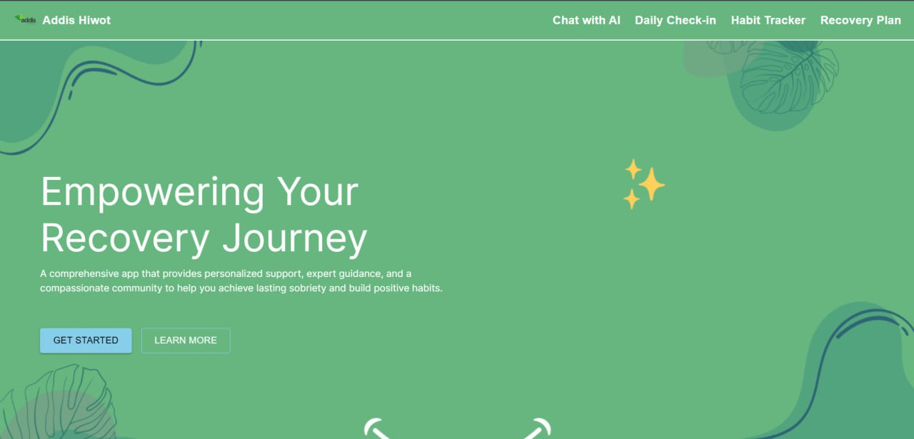
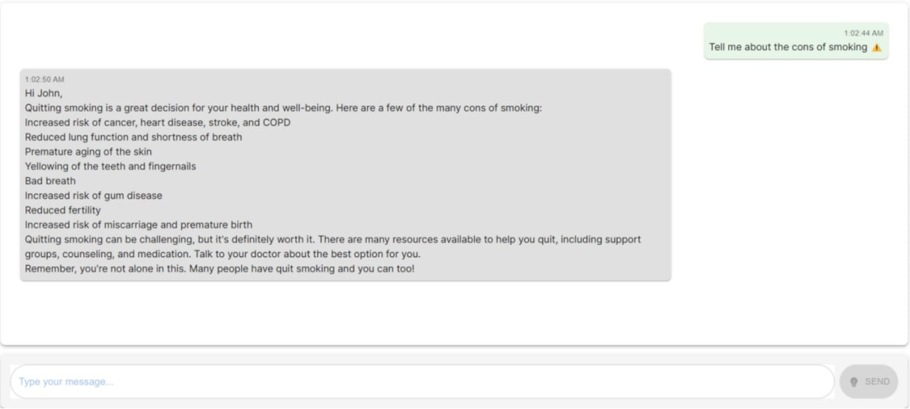
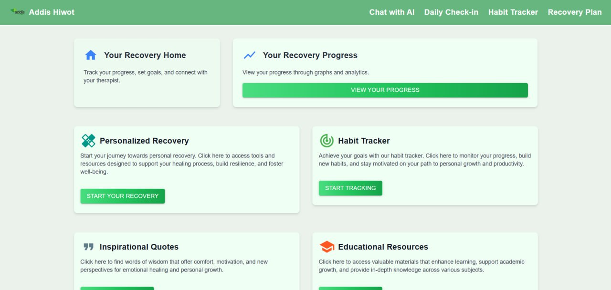
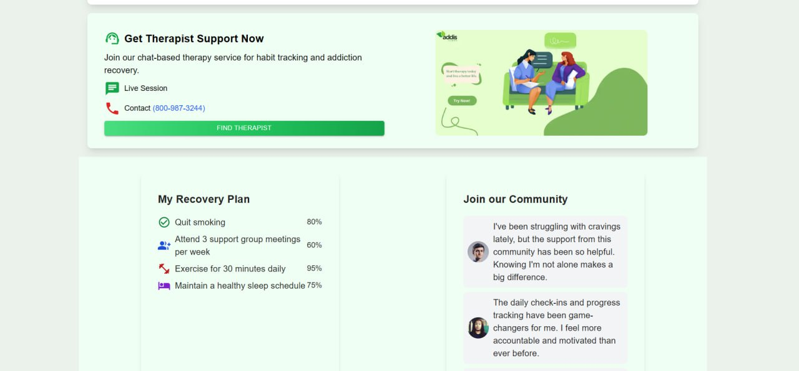

# Addiction Recovery Support Project

An AI-powered platform designed to assist individuals in their journey toward recovery, mental health improvement, and career development.



## Features

### AI Chatbot for Immediate Assistance

- Secure user authentication
- 24/7 empathetic AI support
- Links to helpful articles, hotlines, and support groups



### Personalized Recovery Plans

- User profile with history, preferences, and goals
- AI-generated recovery plans tailored to individual needs
- Adjustable short-term and long-term goals


### Progress Tracking

- Milestone celebration and progress reports
- Data visualization over time



### Mental Health Improvement

- Mood and behavior analysis with sentiment tracking
- Daily check-ins and therapeutic content (mindfulness, CBT)
- Crisis intervention with emergency resource connections



### Upcoming Features

- Community support forums and virtual groups
- Progress dashboard with customizable views
- Privacy and security (encryption, GDPR/HIPAA compliance)

## Quick Start

```bash
git clone https://github.com/abdiesu04/AI-recovery.git
cd AI-recovery/ai-recovery
npm install
npm run dev
```

Open [http://localhost:3000](http://localhost:3000).

For full setup including the backend, see [docs/GETTING_STARTED.md](./docs/GETTING_STARTED.md).

## Documentation

| Document | Description |
|----------|-------------|
| [Getting Started](./docs/GETTING_STARTED.md) | Installation and local setup |
| [Architecture](./docs/ARCHITECTURE.md) | System design and tech stack |
| [API Reference](./docs/API.md) | Backend endpoint documentation |
| [Contributing](./docs/CONTRIBUTING.md) | How to contribute |
| [Code Style](./docs/CODE_STYLE.md) | Formatting and conventions |

## Tech Stack

- **Frontend:** Next.js 14, React 18, TypeScript, Tailwind CSS, MUI
- **Backend:** FastAPI, Python, MongoDB
- **AI:** Google Gemini via LangChain

## Contributing

Contributions are welcome! Please read [docs/CONTRIBUTING.md](./docs/CONTRIBUTING.md) before submitting a pull request.

## License

This project is licensed under the MIT License.
